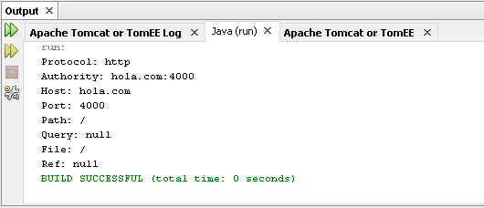
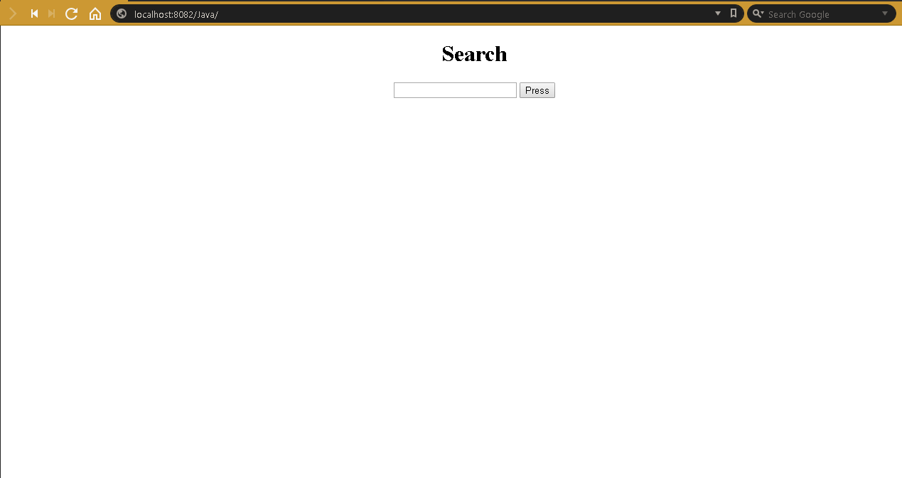
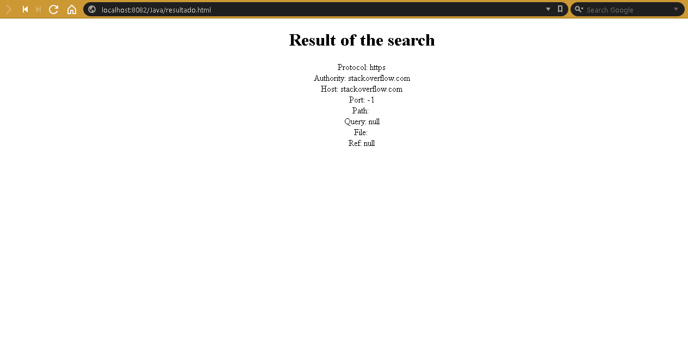
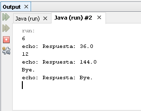
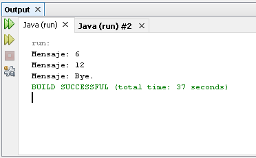

# workshop2

### Exercise 1

> Description: parameters of a URL.

### Exercise 2

> Description: Web application.
### Exercise 4

> Description: images of the functionality of web socket client and web socket server.  

